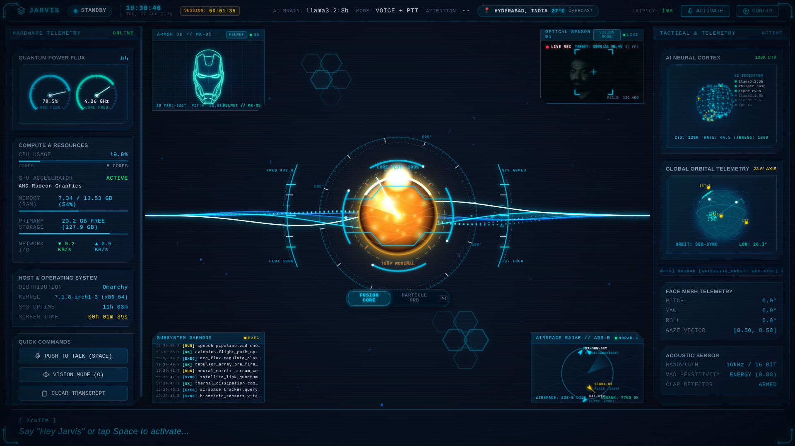

# Jarvis AI — Voice-Interactive Desktop AI Assistant

> *"Sometimes you gotta run before you can walk."* — Tony Stark

**Jarvis AI** is a voice-interactive, local-first desktop AI assistant inspired by the JARVIS system from Marvel's Iron Man. It features a full-screen, transparent holographic HUD visualizer, real-time multi-ring ARC Reactor animation, audio waveform visualization, floating ambient particle systems, and pluggable local/cloud AI backends (STT, TTS, LLM, Vision, and Activation triggers).

<div align="center">
  
</div>

---

## ⚡ Key Features

- **Voice-First Interaction & Multi-Modal Activation**:
  - **Wired real audio pipeline** — actual microphone streaming (SoundDevice) with noise-adaptive VAD (noise-floor tracking, hangover windows, pre-buffering to avoid utterance clipping), live Whisper STT, and sentence-synced streaming neural TTS so speech tracks the transcript.
  - Hands-free Voice Activity Detection (VAD).
  - Push-to-Talk (PTT) with configurable keybinds and hold/toggle modes.
  - Double-clap acoustic pattern detector for hands-free activation (sensitivity configurable, default `0.82`), plus burst-confirmed single-sound fallback.
  - **Natural conversational flow**: barge-in while thinking, audio synced to the transcript, and a voice-detection hold that stays listening after each reply.
  - ALSA mic gain normalization and automatic Ollama model detection.
- **Pluggable Local-First AI Backends**:
  - **STT**: Whisper local inference (`faster-whisper` / `whisper.cpp`) with streaming partial transcripts and offline fallback.
  - **TTS**: Piper neural speech synthesis (`piper-tts` / `speech-dispatcher`) with FIFO streaming speech queue and interrupt support, so sentences are spoken as the LLM streams them.
  - **LLM**: Ollama local large language models (`llama3` / `mistral` / `phi3`) with real-time token streaming.
  - **Vision**: MediaPipe Face Mesh for head pose estimation, gaze tracking, and attention telemetry.
- **Iron Man Holographic HUD (Electron + TypeScript)**:
  - Multi-ring Canvas & CSS ARC Reactor core with state-reactive rotational speeds, pulsing gradients, and color transitions.
  - **Switchable 3D Particle Orb core** — ~1,350 Fibonacci-distributed particles with perspective projection on a rigid sphere that never changes shape, with only a few randomly-pulsing dots (`V` key, toolbar, or Settings to switch; preference persists).
  - 64-bar real-time audio waveform visualizer.
  - State-reactive ambient floating particle system.
  - **Live System Monitor HUD** — real-time CPU, GPU, RAM, Disk, Network, OS/kernel/hostname, and system & session uptime telemetry, rendered with Iron Man HUD aesthetics.
  - **Weather, location & digital clock** in the status bar (fetched live from `wttr.in` with network fallback).
  - Live streaming transcript bar with speaker indicators.
  - Slide-out Settings drawer panel for real-time configuration tuning.
  - Keyboard shortcuts: `V` = toggle core variant, `Space` = PTT, `F2`/`Ctrl+S` = Settings, `Escape` = close.
- **Zero-Dependency Procedural SFX Synthesizer**:
  - Pure Web Audio API synthesized sound effects: power-up sweeps, acoustic chimes, harmonic background hums, and error buzzes.
- **Robust Async Architecture**:
  - Python AsyncIO Event Bus with typed subscription routing.
  - 5-state deterministic finite state machine (`idle`, `listening`, `thinking`, `speaking`, `error`).
  - High-performance WebSocket gateway (`ws://localhost:8765`) with automatic reconnection and state syncing.

---

## 🏛️ System Architecture

```
+-------------------------------------------------------------------------------+
|                             Electron HUD Frontend                            |
|  - Fullscreen transparent window (Iron Man Holographic HUD)                   |
|  - Multi-ring ARC Reactor Canvas & CSS animations (IDLE/LISTENING/THINKING...) |
|  - Switchable 3D Particle Orb core visualizer                                 |
|  - Audio Waveform Visualizer & Particle System Canvas                         |
|  - System Monitor HUD (CPU/GPU/RAM/Disk/Network) & Weather/Clock status bar  |
|  - Status Bar, Streaming Transcript Bar, Settings Overlay Panel               |
|  - Web Audio API Procedural SFX Synthesizer (0 audio asset dependencies)      |
+---------------------------------------^---------------------------------------+
                                        | WebSocket JSON (ws://localhost:8765)
+---------------------------------------v---------------------------------------+
|                            Python AsyncIO Backend                             |
|  +-------------------------------------------------------------------------+  |
|  |                            Core Event Loop                              |  |
|  |   EventBus (asyncio.Queue) <---> StateMachine (5 Jarvis states)         |  |
|  |   Config (JSON/YAML namespace store) <---> WSServer (WebSocket Gateway) |  |
|  +------------------------------------^------------------------------------+  |
|                                       | Internal Events & State Updates       |
|  +------------------------------------v------------------------------------+  |
|                            Plugin Manager                               |  |
|   Base Plugin Interface (start, stop, on_event, get_schema)              |  |
|   Builtin Plugins:                                                      |  |
|     - STT: Whisper (Local whisper.cpp / faster-whisper / mock)          |  |
|     - TTS: Piper (Local piper-tts / speech-dispatcher / mock)          |  |
|     - LLM: Ollama (Local llama3 / mock offline fallback)               |  |
|     - Activation: Push-to-Talk (Global shortcut / hold & toggle)        |  |
|     - Activation: Double-Clap Detector (Energy & peak interval analysis)|  |
|     - Vision: Face Tracker (MediaPipe Face Mesh telemetry / mock)       |  |
|  +-------------------------------------------------------------------------+  |
|  |                            Audio Subsystem                              |  |
|  |   MicStream (SoundDevice/PyAudio) | SpeakerOutput | VAD (Energy/Silero) |  |
|  +-------------------------------------------------------------------------+  |
|  |                            System Monitor                               |  |
|  |   CPU/GPU/Mem/Disk/Network via /proc + psutil (optional) | Weather wttr.in|  |
|  +-------------------------------------------------------------------------+  |
+-------------------------------------------------------------------------------+
```

---

## 📋 Prerequisites

Ensure the following tools are installed on your machine:
- **Operating System**: Linux (Ubuntu 20.04+, Debian, Fedora, Arch) or macOS / Windows with WSL2.
- **Python**: `>= 3.10` (tested on Python 3.10, 3.11, 3.12, 3.14).
- **Node.js**: `>= 18.0.0` (with `npm >= 9.0.0`).
- **Ollama** *(optional for local LLM)*: `ollama run llama3` or `ollama serve`.

---

## 🚀 Quick Start

### 1. Automated Setup
Run the setup script from the root directory to create the Python virtual environment, install dependencies, and build the frontend:

```bash
./scripts/setup.sh
```

### 2. Launch Development Mode
Launch both the backend server and the Electron HUD concurrently with unified logging and clean process cleanup:

```bash
./scripts/dev.sh
```

Press `Ctrl+C` at any time to gracefully terminate both frontend and backend processes.

---

## 🔧 Architecture Details

### 1. Backend Core Event Loop & State Machine
The core backend revolves around an asynchronous publish-subscribe `EventBus` and a deterministic 5-state `StateMachine`:

- **States**:
  - `idle`: Awaiting user activation (PTT, wake word, double clap).
  - `listening`: Capturing microphone audio; running VAD and STT streaming.
  - `thinking`: Prompt sent to LLM; awaiting first response tokens.
  - `speaking`: Synthesizing speech via TTS and rendering audio levels to HUD.
  - `error`: Transient fault state with automatic recovery to `idle`.

State changes are automatically broadcast over the WebSocket gateway to all connected HUD clients.

#### 1a. Conversational Turn Flow (`__main__.py`)
A single voice-driven turn flows through the audio worker and speech handler:

- **IDLE → LISTENING (activation)**: Two hands-free triggers with **burst confirmation** so ordinary room noise can't trip them — the acoustic **double-clap detector** (live-wired into the energy stream) and a confirmed single-sound fallback that requires two consecutive loud frames (floor `0.07`, `3.5×` the ambient noise floor).
- **Listening (VAD)**: The noise floor is adaptively tracked (`ambient_energy = 0.96·ambient + 0.04·energy`). A chunk counts as "voiced" only above `max(0.02, 2.0× ambient)`; ~0.5s of trailing silence closes the utterance (pre-buffered so the start isn't clipped), with an 8-second max-turn safety cap.
- **THINKING → SPEAKING → LISTENING**: LLM tokens are streamed to the HUD `llm_token` event and **spoken as each sentence completes** via a FIFO speech queue, so the audio stays in sync with the live transcript.
- **Barge-in**: While Jarvis is **thinking** the mic stays open (it isn't producing sound), so you can interrupt with a burst-confirmed voice (`2×` consecutive frames, floor `0.08`, `4.5×` ambient). While **speaking** the mic is deliberately closed on speakers so Jarvis never hears and interrupts its own voice (this eliminated an abrupt self-interrupt loop).
- **Voice-detection hold**: After each reply Jarvis returns to **LISTENING** and holds for a 10-second idle timeout before settling back to IDLE, letting you keep talking in a natural back-and-forth.

### 2. Plugin Architecture & Manager
Jarvis uses an extensible, modular plugin system. Plugins inherit from `jarvis.plugins.base.Plugin` and implement lifecycle hooks:
- `start(config)`: Initialize models, background workers, or hardware streams.
- `stop()`: Clean up resources, free memory, and cancel pending tasks.
- `on_event(event)`: Process inbound events and optionally emit or return new events.
- `get_schema()`: Expose a JSON schema describing configurable properties for the Settings UI.

The `PluginManager` dynamically discovers plugins from `backend/jarvis/plugins/builtins/` or user-defined directories, loads their schemas, isolates execution errors, and manages activation/deactivation.

### 3. Electron Holographic HUD Visualizer
The frontend is built with Electron and TypeScript:
- **ARC Reactor Core**: Multi-ring visualizer with customizable speeds and pulsing states.
- **Particle Orb Core**: Switchable 3D particle orb (Fibonacci-distributed point cloud on a rigid sphere with a few randomly-pulsing dots) — toggle with `V`.
- **System Monitor HUD**: Live CPU/GPU/RAM/Disk/Network bars, OS/kernel/hostname, and uptime, driven by `system_telemetry` WebSocket events.
- **Status Bar**: Digital clock, location & live weather, and connection/latency indicators.
- **Waveform Canvas**: 64-band audio spectrum reacting to both microphone input and TTS playback.
- **Particle System Engine**: Floating HUD particles that adjust density and speed according to system state (30 in `idle`, 60 in `listening`, 80 in `thinking`, 100 in `speaking`).
- **Settings Overlay**: Slide-out drawer panel enabling instant runtime adjustments to models, voice rates, temperatures, themes, core variant, and audio thresholds without restarting.

### 4. Procedural SFX Synthesizer
Jarvis features an Iron Man-themed procedural sound engine written using the Web Audio API:
- **Power Up**: Exponential frequency sweep (`100Hz -> 800Hz`) upon activation.
- **Power Down**: Reverse sweep (`800Hz -> 100Hz`) on deactivation.
- **Chime**: Resonant `880Hz` sine ping acknowledging state changes.
- **Error Buzz**: `200Hz -> 100Hz` square wave alert.
- Zero audio asset dependencies — 100% procedurally synthesized in real-time.

---

## 🔌 Plugin Authoring Guide

Writing a custom plugin for Jarvis is straightforward. Create a new Python file in `backend/jarvis/plugins/builtins/` (e.g., `my_plugin.py`):

```python
from __future__ import annotations
from typing import Any, Optional
from jarvis.plugins.base import Plugin, PluginType
from jarvis.core.bus import Event, EventBus
from jarvis.core.config import Config


class CustomPlugin(Plugin):
    """Custom Jarvis Plugin Example."""

    name = "custom_plugin"
    plugin_type = PluginType.ACTIVATION  # or STT, TTS, LLM, VISION, GENERIC

    def __init__(self, bus: Optional[EventBus] = None, config: Optional[Config] = None) -> None:
        super().__init__(bus=bus, config=config)
        self._threshold = 0.5
        self._running = False

    async def start(self, config: Optional[dict[str, Any]] = None) -> None:
        """Initialize plugin resources."""
        cfg = config or {}
        self._threshold = cfg.get("threshold", 0.5)
        self._running = True
        print(f"Custom plugin started with threshold: {self._threshold}")

    async def stop(self) -> None:
        """Clean up plugin resources."""
        self._running = False
        print("Custom plugin stopped")

    async def on_event(self, event: Event) -> Optional[Event]:
        """Handle incoming events."""
        if not self._running:
            return None

        if event.type == "custom_trigger":
            # Emit or return a response event
            return Event(
                type="activation",
                data={"source": self.name},
                source=self.name,
            )
        return None

    def get_schema(self) -> dict[str, Any]:
        """JSON Schema for Settings Drawer auto-generation."""
        return {
            "type": "object",
            "properties": {
                "threshold": {
                    "type": "number",
                    "default": 0.5,
                    "description": "Trigger sensitivity threshold",
                }
            },
        }


# Register the plugin class for discovery
plugin_class = CustomPlugin
```

Once placed in `backend/jarvis/plugins/builtins/`, the `PluginManager` will automatically discover and register your plugin on next launch.

---

## ⚙️ Configuration Guide

Jarvis AI provides both modular JSON configuration namespaces in `config/` and a unified master default YAML in `config/default.yaml`.

### Configuration Directory Structure
```
config/
├── default.yaml            # Master reference configuration
├── core.json               # Backend host, port, sample/chunk rate, logging, theme
├── voice.json              # STT/TTS plugin selection, voice, rate, sensitivity, volume
├── brain.json              # LLM plugin, model, temperature, max tokens, system prompt
├── activation.json         # Wake word, PTT (key/mode), clap toggles
├── appearance.json         # Theme, core variant, particle density, CRTs, glow, ui scale
├── vision.json             # Camera index, face tracking / gaze / helmet boot toggles
├── sfx.json                # Master volume + per-SFX enable toggles
├── plugins/
│   ├── whisper_local.json  # Whisper STT model & language
│   ├── piper_tts.json      # Piper TTS voice, rate & sample rate
│   ├── ollama_llm.json     # Ollama model name & endpoint URL
│   ├── push_to_talk.json   # Keybind and mode (hold/toggle)
│   ├── clap_detector.json  # Audio peak threshold (default 0.82) & window
│   └── face_tracker.json   # Camera index & confidence threshold
└── themes/
    ├── arc-reactor.json    # HUD color palette & ring speeds
    └── iron_man.json       # HUD particle density & accent colors
```

### Runtime Updates
You can update configuration live through:
1. **The HUD Settings Panel**: Open settings (`F2`, `Ctrl+S`, or click the settings cog) to update values. Changes are saved to the matching JSON namespace and broadcast (`config_updated`) so all clients stay in sync.
2. **WebSocket Message**: Send a `config_update` / `settings_save` event:
   ```json
   {
     "type": "config_update",
     "plugin": "ollama_llm",
     "key": "model",
     "value": "mistral"
   }
   ```

---

## 🧪 Testing & Verification

### Run Backend Unit Tests (Pytest)
Run all test suites covering EventBus, StateMachine, Config, WebSocket Server, Audio, all built-in Plugins, System Monitor, plus the adversarial suite (malformed WS payloads, plugin error isolation, config edge cases):

```bash
cd backend
python3 -m pytest tests/ -v
```

### Run Adversarial Tests Only
```bash
cd backend
python3 -m pytest tests/adversarial/ -v
```

### Build & Type-Check Frontend
Run TypeScript compilation and asset bundling:

```bash
cd frontend
npm run build
```

---

## 📄 License

MIT License. Designed with ❤️ for desktop AI and Iron Man enthusiasts.
